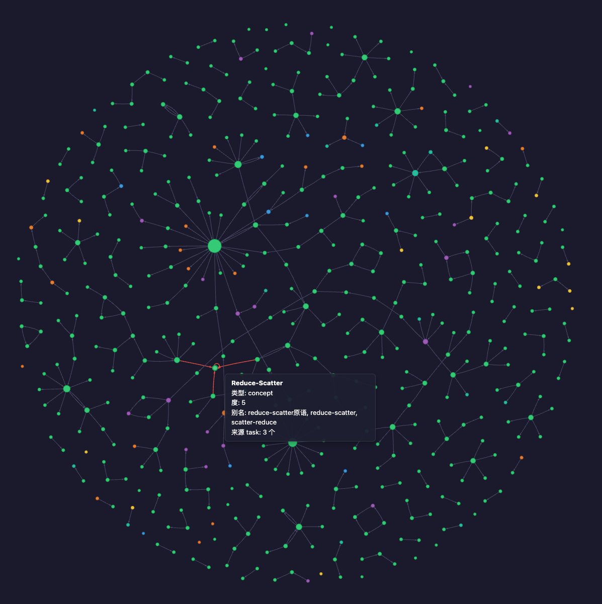
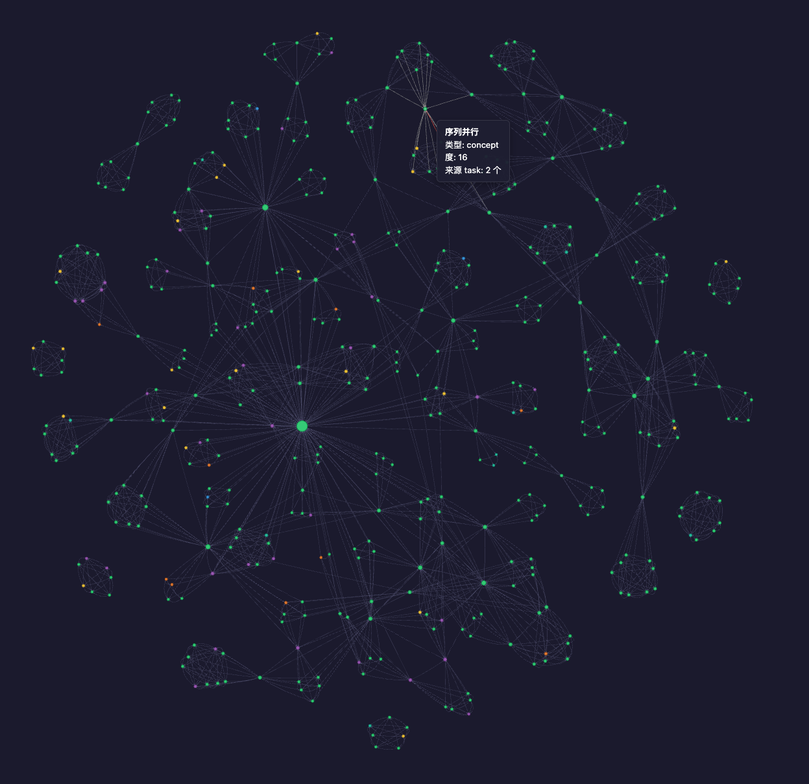
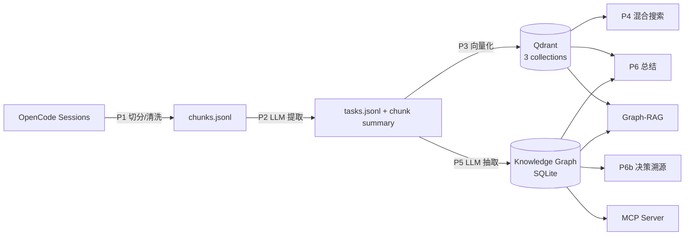

<div align="center">

# OpenCode Session Knowledge Graph

从 [OpenCode](https://github.com/sst/opencode) 会话历史中提取结构化知识，构建跨 session 知识图谱，支持语义搜索、Graph-RAG、主题总结与决策溯源。

[](https://www.python.org/downloads/)
[](https://qdrant.tech/)
[](https://modelcontextprotocol.io/)
[]()

</div>

## 知识图谱效果

P5 支持两种提取模式（`run_phase5.sh` 一次跑完两种 + 可视化）：

**Triple 模式** — 三元组提取，hub-and-spoke 拓扑，稀疏分支，便于查看关系链路



**Entity 模式** — 实体共现，稠密 clique 聚簇，聚簇间桥接，平均度数更高



打开 `output/{triple,entity}/knowledge_graph.html` 即可在浏览器中交互（缩放、拖拽、悬停查看实体元数据与来源 task）。

## 功能

- **跨 Session 搜索** — Dense + BM25 + RRF 融合 + Qwen3-Reranker 精排
- **知识图谱构建** — LLM 提取三元组 / 实体共现，实体对齐（向量相似度 + LLM + UnionFind 合并），NetworkX 图
- **Graph-RAG** — 向量检索 + 图谱 BFS 扩散 + Reranker 融合
- **跨 Session 总结** — 检索 Top-K Task → Token 预算裁剪 → LLM 生成主题总结
- **决策溯源** — 多 hop 追踪技术决策链（选用 / 选型 / 排除 / 替换 / 依赖）
- **MCP Server** — 标准协议，支持 Claude Code / Codex / OpenCode / QoderWork 开箱接入

## 架构



| Phase | 说明 | 详细文档 |
|-------|------|----------|
| **P1** 数据预处理 | Session → chunk，按 user message 边界切分，清洗 tool 输出 | [`doc/code_p1_README.md`](doc/code_p1_README.md) |
| **P2** | LLM CoT 提取结构化任务 + chunk 摘要 | [`doc/code_p2_README.md`](doc/code_p2_README.md) |
| **P3** 向量存储 | Qdrant 三个集合，Dense 支持 BM25 索引 | [`doc/code_p3_README.md`](doc/code_p3_README.md) |
| **P4** 跨 Session 搜索 | 两级 RRF → Reranker 精排 → chunk 展开 | [`doc/code_p4_README.md`](doc/code_p4_README.md) ✨核心 |
| **P5** 知识图谱 | `run_phase5.sh` 串行跑 triple + entity 两种模式，实体对齐，NetworkX 图 + pyvis 可视化 | [`doc/code_p5_README.md`](doc/code_p5_README.md) ✨核心 |
| **P5e** SQLite + Graph-RAG | 图谱持久化 + 向量检索 + 图 BFS 扩散 + Reranker 合并 | [`doc/code_p5e.md`](doc/code_p5e.md) |
| **P6** 跨 Session 总结 | Top-K Task → Token 裁剪 → LLM 主题总结 | [`doc/code_p6.md`](doc/code_p6.md) |
| **P6b** 决策溯源 + 骨架总结 | 多 hop 决策链追踪 + 图结构注入的因果总结 | [`doc/code_p6b.md`](doc/code_p6b.md) |
| **MCP** MCP Server | 5 个工具，Claude Code / Codex / OpenCode / QoderWork 即插即用 | [`doc/code_mcp.md`](doc/code_mcp.md) |

## 快速开始

```bash
# 1. 安装依赖
bash install.sh
source .venv/bin/activate

# 2. 设置 API Key
export OPENCODE_ZEN_API_KEY=$(python3 -c \
  "import json; d=json.load(open('$HOME/.local/share/opencode/auth.json')); print(d['opencode-go']['key'])")

# 3. HuggingFace 离线模式（避免模型下载超时）
export TRANSFORMERS_OFFLINE=1 && export HF_HUB_OFFLINE=1

# 4. 端到端运行（P1 → P5）
python3 src/code_p1_main.py && \
python3 src/code_p2_main.py && \
python3 src/code_p3_main.py && \
bash run_phase5.sh

# 5. 搜索
python3 src/code_p4_search_cli.py --query "FlashAttention 实现原理"

# 6. 主题总结 + 决策溯源
python3 src/code_p6b_cli.py summary "FlashAttention"
python3 src/code_p6b_cli.py trace "FlashAttention"
```

> 数据源默认读取 `~/.local/share/opencode/opencode.db`，也可用 `--sqlite <path>` 或 `--mock` 指定。

## 目录结构

```
oc_sess_graph/
├── src/                  # Python 源码（扁平结构，code_p{N}_ 前缀区分 phase）
├── config/               # YAML 配置文件
├── prompts/             # LLM Prompt 模板
├── doc/                  # 各 Phase 详细文档 + 系统架构图（SVG）
├── output/               # 流水线输出（gitignore）
├── qdrant_data/          # 嵌入式 Qdrant 存储目录（gitignore，可选；生产推荐用 server 模式）
├── tests/                # P2/P5 benchmark 脚本
├── lib/                  # pyvis 前端资源
├── requirements.txt
└── install.sh            # 安装脚本（集安装 + 模型下载）
```

## 使用示例

```bash
# 跨 Session 搜索
python3 src/code_p4_search_cli.py --query "序列并行和 FlashAttention 的关系" --top-k 5

# 决策溯源（图谱多 hop 追踪）
python3 src/code_p6b_cli.py trace "OpenCode" --hops 2 --json

# 骨架总结（注入决策链 + 图结构）
python3 src/code_p6b_cli.py summary "FlashAttention" --max-tasks 5

# Graph-RAG 增强总结
python3 src/code_p6_cli.py "opencode 功能" --graph-rag

# 时间范围过滤
python3 src/code_p6_cli.py "性能优化" --time-from 2026-07-01 --time-to 2026-07-15
```

## Qdrant 部署

P3 把向量数据存进 Qdrant 集合（`tasks` / `chunks_summary` / `chunks_cleaned_text` / `entities`），支持两种部署模式，由 `qdrant.url` 配置字段或 `QDRANT_URL` 环境变量切换：

| 模式 | 触发条件 | 多进程 | 适用场景 |
|---|---|---|---|
| **Embedded** | `qdrant.url` 为空且无 `QDRANT_URL` 环境变量 | ❌ 单进程独占（文件锁） | 单机脚本、build pipeline、CI 任务 |
| **Server** | `qdrant.url: "http://host:port"` 或 `QDRANT_URL=http://...` | ✅ 任意多客户端 | 多 IDE/多 session 共享、生产部署 |

**优先级**:`QDRANT_URL` 环境变量 > `config/*.yaml` 里的 `qdrant.url` > 默认 embedded。

### Server 模式快速启动

```bash
# 1. 启动 Qdrant server（Docker）
docker run -d --name qdrant \
  -p 6333:6333 -p 6334:6334 \
  -v $(pwd)/qdrant_data_server:/qdrant/storage \
  qdrant/qdrant:v1.19.0

# 2. 验证
curl http://localhost:6333/healthz
# → healthz check passed

# 3. 让所有 phase 工具走 server 模式
export QDRANT_URL=http://localhost:6333
python3 src/code_p3_main.py    # 写入时会建 collection
python3 src/code_p4_search_cli.py --query "..."
```

### 从 Embedded 迁移到 Server

代码内置迁移脚本，一次性把 `qdrant_data/` 的本地数据搬到 server：

```bash
# 1. 预览 schema（不写数据）
python3 utils/migrate_qdrant_to_server.py --dry-run

# 2. 全量迁移（自动 drop + recreate + upsert）
python3 utils/migrate_qdrant_to_server.py

# 3. 验证 points_count
curl http://localhost:6333/collections/tasks | jq .result.points_count
```

参数：
- `--src <path>`（默认 `./qdrant_data`）
- `--dst <url>`（默认 `http://localhost:6333`）
- `--collections tasks chunks_summary ...`（子集迁移）
- `--no-recreate`（追加模式，dst 集合必须已存在）
- `--batch-size 200`（scroll 批次）

典型耗时：~2000 points / 1.5 秒（本地 + 同机 Docker）。脚本内已用 `PointStruct` 适配 Qdrant 1.19+ 严格类型校验。

### 故障排查

| 症状 | 原因 | 解决 |
|---|---|---|
| `RuntimeError: Storage folder ... already accessed by another instance` | Embedded 模式被多进程同时打开 | 杀掉残留 `code_mcp_server.py` 进程，或切换到 server 模式 |
| 搜索 `vector_results: 0` 但 `points_count > 0` | Server 集合存在但 optimizer 未建索引（< `full_scan_threshold=10000` 用全扫描，不走 HNSW） | 正常现象，1–2 秒后会回填；或调高 `indexing_threshold` |
| `Wrong input: Vector dimension error` | Query 向量维度与 collection 不匹配 | 检查 `embedding.dim`（默认 512）与 collection `vectors.size` 一致 |
| MCP server 启动后看不到新数据 | `QDRANT_URL` 写在 env 而没持久化到 config | 把 `qdrant.url: http://localhost:6333` 写进 `config/code_p3_config.yaml` |
| Docker qdrant 5 天没数据 | 配置指向了 server，但从未执行过 P3/P4 写入 | 跑一次 `python3 src/code_p3_main.py` 或用 `migrate_qdrant_to_server.py` 灌数据 |

> 📌 **维护建议**:把 `QDRANT_URL` 同时写进 `code_p3_config.yaml` 的 `qdrant.url` 字段，避免 env 丢失后静默回退 embedded。

## MCP 集成

将知识图谱作为 MCP Server 加载到你的 AI 编码工具，开箱即用 5 个工具：

| 工具 | 说明 |
|------|------|
| `query_kg` | BFS 扩散查询，获取实体关联 task |
| `search_entities` | 模糊搜索实体 |
| `get_entity_info` | 实体详情（节点 + 边） |
| `graph_rag_search` | Graph-RAG 增强搜索 |
| `get_kg_stats` | 图谱统计信息 |

<details>
<summary><b>客户端配置</b></summary>

**OpenCode** — `opencode.json`:
```json
{
  "mcp": {
    "knowledge-graph": {
      "type": "stdio",
      "command": "python3",
      "args": ["/absolute/path/to/src/code_mcp_server.py"],
      "env": { "TRANSFORMERS_OFFLINE": "1", "HF_HUB_OFFLINE": "1" }
    }
  }
}
```

**Claude Code** — `.claude/mcp.json`:
```json
{
  "mcpServers": {
    "knowledge-graph": {
      "command": "python3",
      "args": ["/absolute/path/to/src/code_mcp_server.py"],
      "env": { "TRANSFORMERS_OFFLINE": "1", "HF_HUB_OFFLINE": "1" }
    }
  }
}
```

**QoderWork** — 在 Connectors 设置中粘贴同样的 `mcpServers` 块即可。

</details>

## 配置参考

| 配置文件 | Phase | 主要配置项 |
|---------|-------|-----------|
| `config/code_p1_config.yaml` | P1 | 数据路径, session 过滤 |
| `config/code_p2_config.yaml` | P2 | LLM 模型, API 地址, 并发数, 重试策略 |
| `config/code_p3_config.yaml` | P3/P4/P6/P6b | Embedding 模型, BM25 参数, Qdrant 路径, Reranker 模型, RRF 融合 |
| `config/code_p5_config.yaml` | P5/P5e | LLM 模型, 实体对齐阈值, 提取模式, SQLite 导出, Graph-RAG 参数 |
| `config/code_p6_config.yaml` | P6 | 总结 LLM, token 预算, 搜索参数, 时间过滤 |
| `config/code_p6b_config.yaml` | P6b | 决策关系分类, BFS 参数, 数据库路径 |
| `config/code_mcp_config.yaml` | MCP | 服务 DB 路径, 上下文注入参数 |

> 注：`code_p3_config.yaml` 被 P3/P4/P6/P6b 共用；P6/P6b 的 YAML 为 advisory，实际参数硬编码在 `code_p6_summarizer.py` / `code_p6b_skeleton.py`。

## 输出清理（code_cleanup）

按 phase 选择性清理流水线产物，默认 dry-run，需显式 `--yes` 才真删。详见 `doc/code_cleanup_README.md`。

```bash
# 列出所有 phase 产物
python3 src/code_cleanup.py list

# 预览删除计划
python3 src/code_cleanup.py clean --p2

# 真删 + 级联删除下游孤儿
python3 src/code_cleanup.py clean --p1 --cascade --yes
```

## 更多文档

- `doc/` — 各 Phase 详细设计文档 + 系统架构 SVG 图（`fig1`~`fig6`） + 各 phase README
- `doc/code_p4_README.md` / `doc/code_p5_README.md` — 搜索与图谱核心模块设计
- `prompts/` — 所有 LLM Prompt 模板
- `tests/` — P2 / P5 benchmark 脚本（独立 CLI 程序，非 pytest）